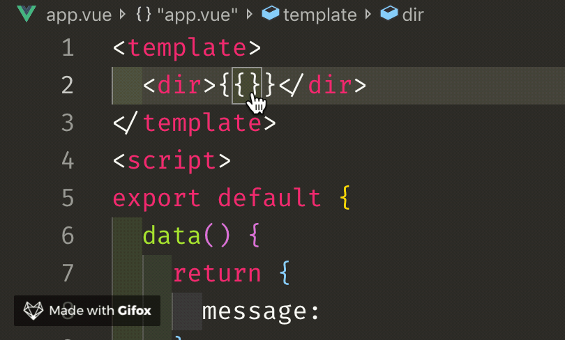

# fluent-i18n（zh-CN）

i18n 通常方案是根据不同语言查找对应的map。这种方案在开发时存在的一大问题是大量的key，使开发者无法全部记忆，每次使用都需要查找映射表，严重影响开发效率。本项目是为了解决该问题，提高开发效率：

- 在js中使用：


- 在vue模板中使用：



## 使用方式

下载插件后，在配置中添加keys

```json
{
  "fluentI18n.autoCompletion.keys": [
    "confirm",
    "OK",
    "cancel",
    "Error",
    "Hello i18n"
  ]
}
```

在js,ts,vue 文件中会自动获取配置中keys,并在输入`t(`或者`$t(`时触发auto-completion